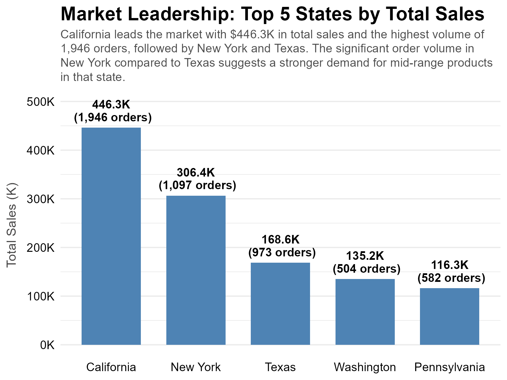
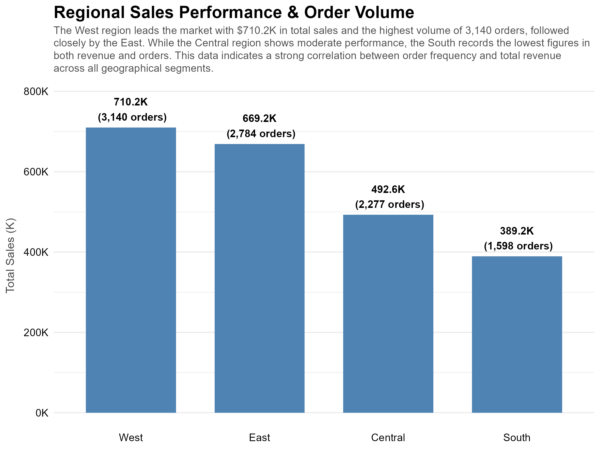
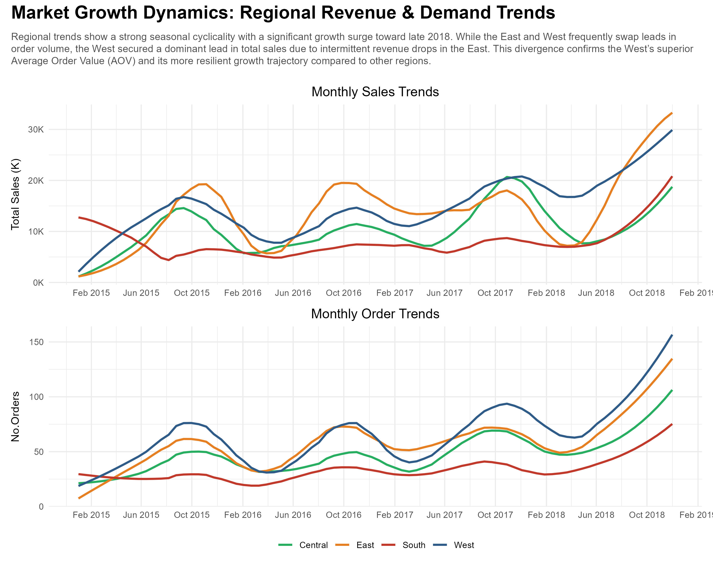
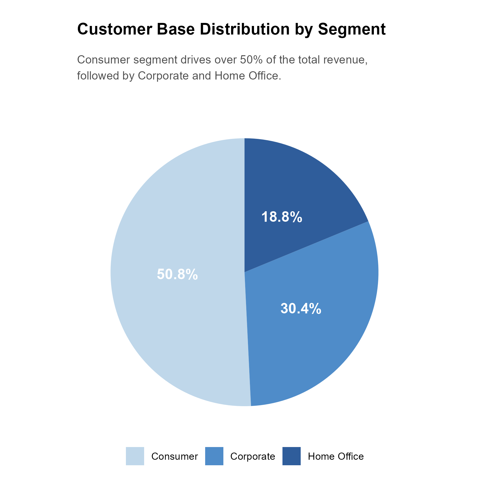
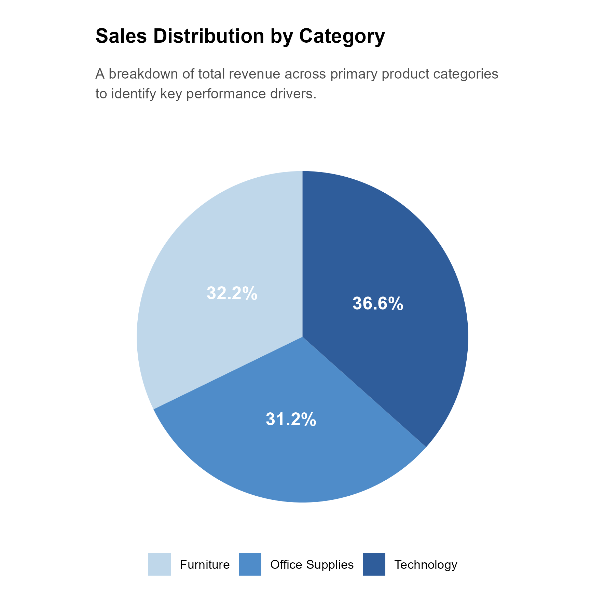
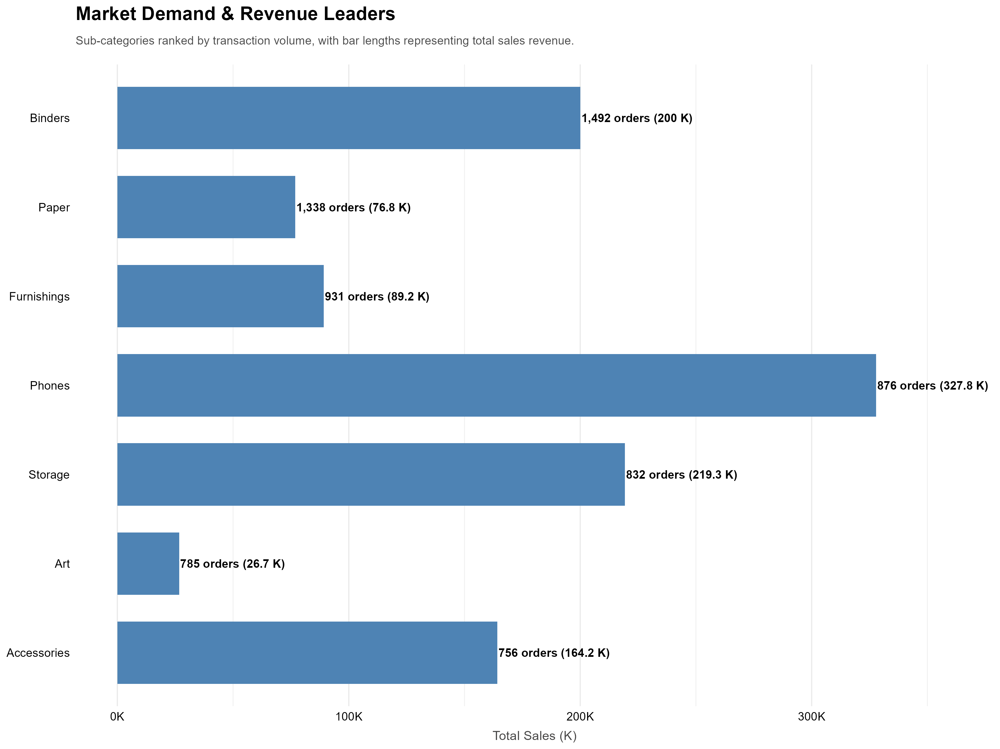
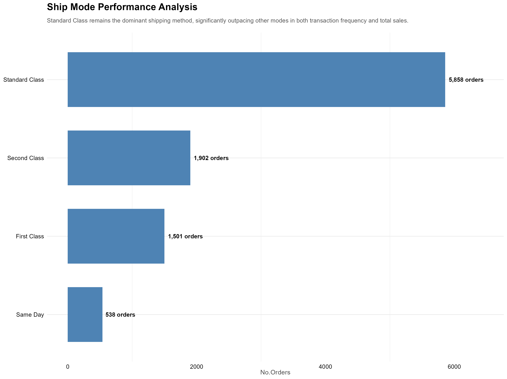
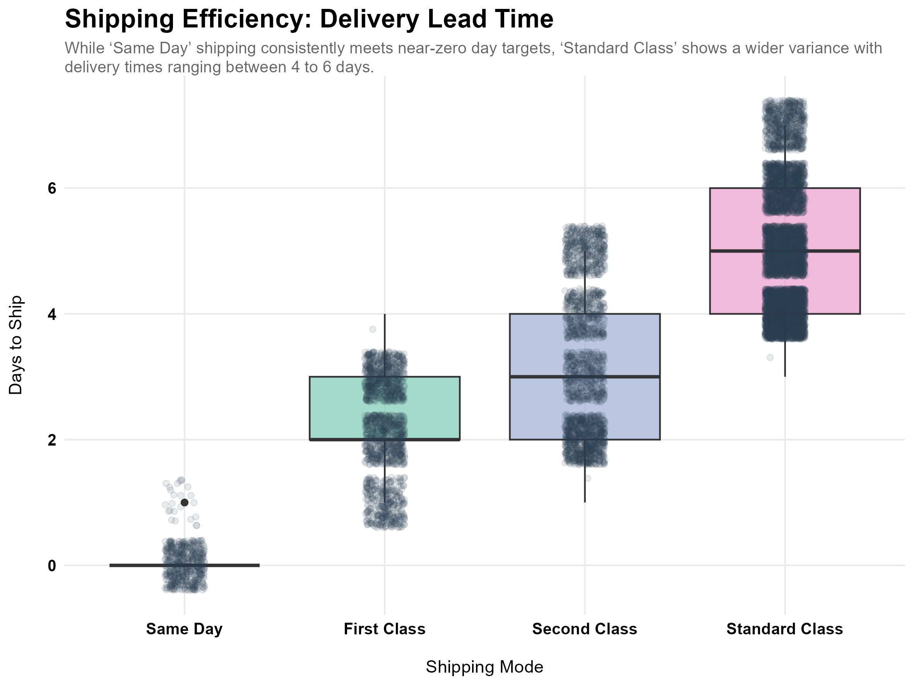

```{css, echo=FALSE}

  .bordered-image {
    border: 2px solid #DCDCDC; 
    padding: 5px;              
    background-color: white;   
  }
  
  table tr td:first-child {
    border-right: 2px solid #DCDCDC;
    padding-right: 15px;
    width: 70%;
  }
  table tr td:last-child {
    padding-left: 15px;
    width: 30%;
  }


```{r setup, include=FALSE}
knitr::opts_chunk$set(
  echo = TRUE,        
  warning = FALSE,     
  message = FALSE,     
  fig.align = "center",
  out.width = "100%"   
)
```
---

# Introduction {-}

This report explores retail sales performance using the Superstore dataset.
The objective is to identify key revenue drivers, customer behavior patterns,
and regional performance trends.

The analysis focuses on:

- Sales performance by state and region.
- Customer segment contribution.
- Product category distribution.
- Shipping performance.
- Monthly revenue trends.

---

# Load Libraries {-}

```{r}
library(tidyverse)
library(lubridate)
library(scales)
library(ggtext)
library(patchwork)
library(janitor)
library(ggplot2)
```

```{r echo=FALSE}
library(knitr)
```
---

# Data Socure {-}

The raw data are stored in a CSV file located at:
```
../data/raw/train.csv
```
---

# Data Preparation {-}

The dataset was cleaned and standardized before the analysis stage.

Key cleaning steps included:

- Standardizing column names using `janitor::clean_names()`
- Converting date variables to proper date format
- Removing duplicated rows
- Converting categorical variables to factors
- Verifying missing values across all variables

The cleaned dataset was then saved as:

```
data/processed/data_cleaned.rds
```
---

# Load Clean Data {-}
  
```{r}
data <- readRDS("../data/processed/data_cleaned.rds")
```
---

# Key Performance Indicators (KPIs) {-}

```{r echo=FALSE}
total_sales <- sum(data$sales)
average_sales <- mean(data$sales)
total_orders <- nrow(data)

kpi <- tibble(
Metric = c("Total Sales","Average Sales","Total Orders"),
Value = c(
    paste0("$ ",format(total_sales, big.mark = ",", nsmall = 2, digits = 2)), 
    paste0("$ ",format(average_sales, big.mark = ",", nsmall = 2, digits = 2)), 
    format(as.integer(total_orders), big.mark = ",") )
  )

kable(kpi, 
      caption = "Key Performance Indicators (KPIs)",
      align = c("l", "r")
      )
```
---

# Sales by State {-}

The analysis found that California leads the market not only in total sales **($446.3K)** but also in the highest number of orders **(1,946)**. Although Texas ranks third in total sales, it recorded **973** orders, while New York placed 1,097 orders, significantly exceeding Texas. This suggests that the demand for mid-range products is considerably higher in New York than in Texas.

```{r, out.extra='class="bordered-image"'}

```

---

# Sales by Region {-}

The analysis shows that the West region leads the market with **$710.2K** in total sales and the highest order volume **(3,140 orders)**, followed closely by the East. The Central region demonstrates moderate performance, while the South records the lowest figures in both revenue and order volume. These results suggest a strong relationship between order frequency and total revenue across all regions.

```{r, out.extra='class="bordered-image"'}

```

---

# Time Series Analysis {-}

The analysis shows that regional trends exhibit strong seasonal cyclicality, with a significant growth surge toward late 2018. While the East and West frequently alternate in leading order volume, the West maintains a dominant lead in total sales due to intermittent revenue drops in the East. This divergence suggests that the West has a higher Average Order Value (AOV) and a more resilient growth trajectory compared to other regions.

```{r , out.extra='class="bordered-image"'}

```

---

# Customer Segments {-}

The analysis shows that Consumer segment drives over 50% of total revenue, followed by the Corporate and Home Office.

```{r, out.extra='class="bordered-image"'}

```

---

# Product Categories {-}

The analysis reveals that Technology leads in total sales, followed by Furniture and Office Supplies. This suggests that technology products are the primary revenue drivers within the dataset, while office supplies contribute the least to overall sales performance.

```{r, out.extra='class="bordered-image"'}

```

---

# Sub-Categories{-}

The analysis shows that while Binders and Paper lead in order frequency, reflecting strong market demand, Phones and Storage generate significantly higher revenue despite having fewer transactions. This suggests a higher Average Order Value (AOV) for technology-related categories compared to high-turnover office supplies.

```{r, out.extra='class="bordered-image"'}

```

---

# Shipping Analysis {-}

The analysis shows that the standard class dominance (exceeding 50% of total orders) suggests that the majority of the customer base prioritizes cost-effectiveness over delivery speed. This high transaction frequency indicates a stable, predictable supply chain requirement, allowing for optimized bulk shipping and lower logistics overhead. However, the significant gap between Standard and 'First Class' or 'Same Day' options presents an opportunity to introduce premium loyalty incentives or 'expedited shipping' promotions to increase service-level revenue.

```{r, out.extra='class="bordered-image"'}

```

---

# Delivery analysis {-}

The analysis shows that the near-zero variance in Same Day shipping confirms a highly disciplined logistics channel capable of meeting strict SLAs, albeit likely at a higher operational cost. In contrast, the 4–6 day range for Standard Class suggests a consolidated shipping model in which orders are batched to maximize trailer utilization. While this variability is expected in lower-cost tiers, narrowing the delivery window to a consistent 4 days could significantly improve customer satisfaction without necessarily increasing the logistics budget.

```{r , out.extra='class="bordered-image"'}

```

---

# Key Insights {-}

  The analysis reveals several important findings:

* The West region leads total sales performance.

* A small number of states drive a large portion of revenue.

* The Consumer segment represents the largest share of total revenue.

* Sales trends show seasonal growth patterns.

* Shipping performance varies significantly by shipping mode.

---

# Conclusion {-}

This exploratory analysis highlights key revenue drivers and demand patterns within the retail dataset. Understanding these dynamics helps businesses improve marketing strategies, optimize logistics, and focus on high-performing regions and product segments.